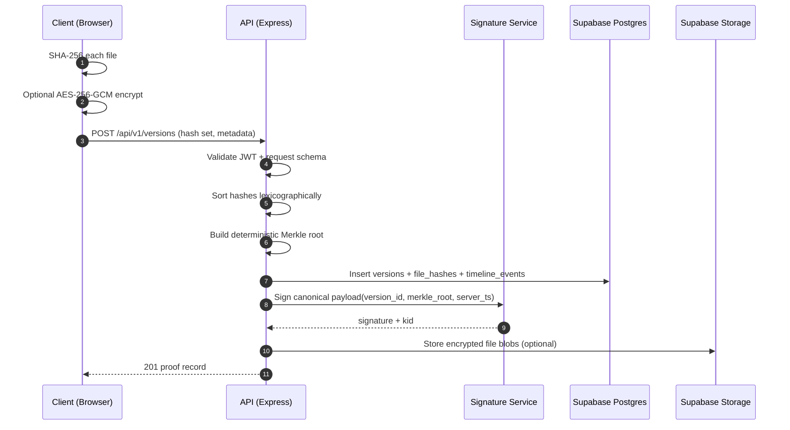
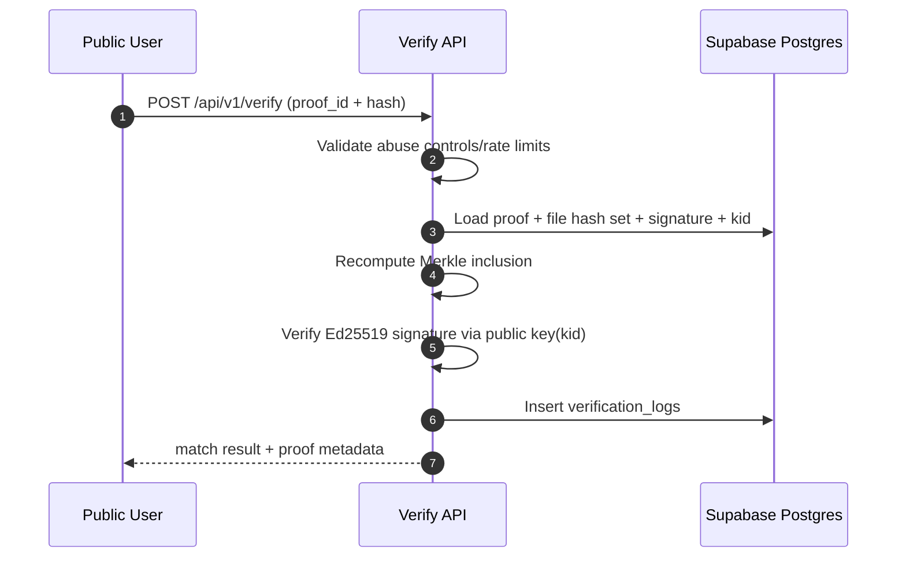

# 02 — Data Flow Contracts (Phase 1)

## A) Create Signed Version



### Canonical request contract (draft)

```json
{
  "work_item_id": "uuid",
  "files": [
    {
      "file_name": "design-v3.fig",
      "file_size": 421337,
      "sha256_hash": "hex-string-64",
      "encrypted_storage_path": "optional/path"
    }
  ]
}
```

### Canonical response contract (draft)

```json
{
  "version_id": "uuid",
  "version_number": 3,
  "merkle_root": "hex-string-64",
  "server_timestamp": "2026-02-13T18:40:11.000Z",
  "signature": "base64",
  "kid": "signing-key-2026-q1"
}
```

## B) Public Verification



## Contract Rules (must-haves)

1. Hashes are lowercase hex; 64-char fixed length.
2. Merkle construction is deterministic and independent of upload order.
3. `server_timestamp` is generated server-side only.
4. Signature payload is canonicalized to stable byte representation.
5. `kid` is mandatory in all signed responses for long-term verification.
