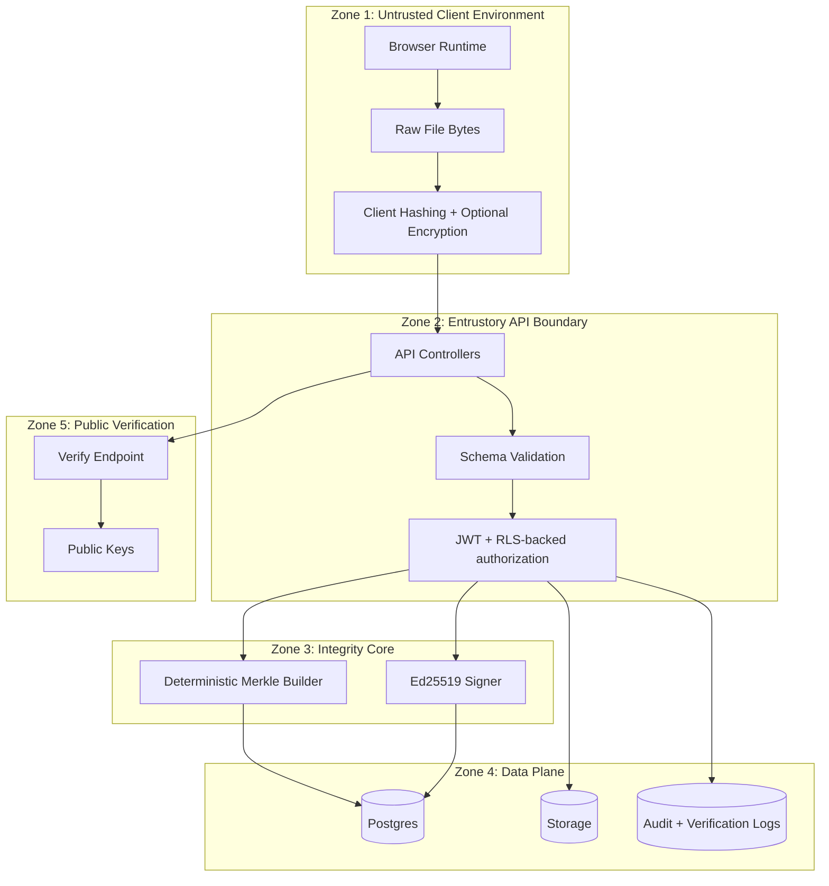

# 03 — Trust Boundaries and Security Controls (Phase 1)

## Trust Zones

## Boundary Risks + Control Mapping

- **Client tampering risk** → Hashes and proofs must be independently recomputable.
- **API payload manipulation** → Strict schema validation + canonicalization.
- **Database tampering risk** → Signature verification must fail on altered records.
- **Malicious record deletion** → Append-only timeline_events via DB trigger.
- **Verification abuse** → Rate limits + IP throttling + verification logs.

## Security Invariants

1. No trust in client-provided timestamps.
2. No UPDATE/DELETE on immutable timeline tables.
3. Signature verification must be possible without backend cooperation.
4. Encryption keys for zero-knowledge mode are never persisted server-side.
