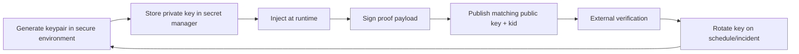

# 04 — Key Management Baseline (Phase 1)

## Goal

Define operational handling of Ed25519 signing keys used for proof records.

## Key Lifecycle

## Requirements

- Active private key never committed to repository.
- Public keys are versioned with `kid` and exposed publicly.
- Historical public keys remain available to verify old proofs.
- Signing events are auditable (time, endpoint, key id, actor/service).

## Operational Policy

- **Rotation cadence**: quarterly baseline; immediate rotation on compromise.
- **Key scope**: integrity signatures only (not auth JWT signing).
- **Environment separation**: distinct key material per env (dev/staging/prod).
- **Incident posture**: compromised key is revoked; verifier still checks legacy proofs with archived public key set.

## Verification Payload Canonical Form

To avoid ambiguity, the signed message is UTF-8 bytes of:

`version_id + ":" + merkle_root + ":" + server_timestamp + ":" + kid`

This format should be captured in test vectors before Phase 3 implementation.
