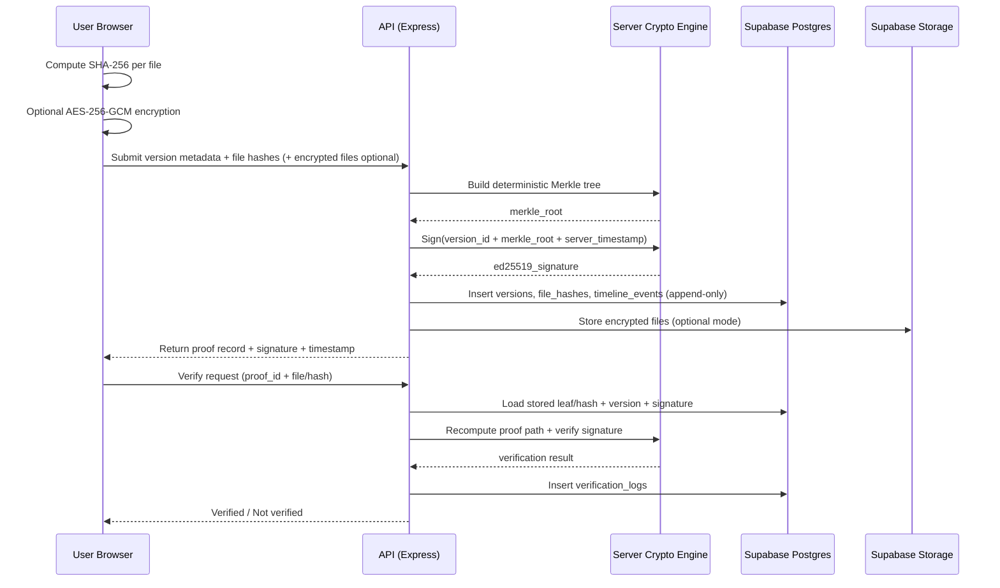

# ENTRUSTORY – Phase 1 System Architecture Design

This document begins **Phase 1** from the roadmap and provides the first-pass deliverables:

- Architecture diagram
- Data flow diagram
- Trust boundary diagram
- Key management diagram

---

## 1) System Layers (High-Level Architecture)

```mermaid
flowchart TB
    U[User Browser<br/>React + TypeScript + Vite] -->|HTTPS| A[API Layer<br/>Node.js + Express]
    U -->|Client-side SHA-256<br/>(Optional AES-256-GCM)| C[Crypto Client Module]
    C -->|Hashes / encrypted payload metadata| A

    A --> DB[(Supabase PostgreSQL)]
    A --> ST[(Supabase Storage)]
    A --> AU[(Supabase Auth)]

    A --> SI[Server Integrity Module<br/>Deterministic Merkle + Ed25519 signing]
    SI --> DB

    A --> LOG[Monitoring & Logging<br/>Audit + verification logs]
    DB --> BK[Backup & Recovery]
    ST --> BK
```

### Layer responsibilities

1. **Client Application**: hashing/encryption before upload, dashboard UX, verification UX.
2. **API Layer**: authn/authz, validation, version orchestration, proof endpoints.
3. **Cryptographic Engine**: deterministic Merkle generation + Ed25519 signatures.
4. **Supabase Core**: Auth, PostgreSQL, Storage with RLS.
5. **Monitoring & Logging**: audit trail, verification attempt tracking, abuse signals.
6. **Backup & Recovery**: database and storage recovery strategy.

---

## 2) Data Flow Diagram (Proof Creation + Verification)



---

## 3) Trust Boundary Diagram

```mermaid
flowchart LR
    subgraph Client_Trust_Boundary[Client Boundary (Less Trusted by platform, but source of raw file)]
      B[Browser Runtime]
      F[Raw Files]
      H[Local Hashing/Encryption]
      B --> F --> H
    end

    subgraph Server_Trust_Boundary[Entrustory Controlled Boundary]
      API[API Service]
      CR[Cryptographic Services]
      DB[(Postgres + RLS)]
      SG[Storage]
      API --> CR
      API --> DB
      API --> SG
    end

    subgraph Public_Verification_Boundary[Public Verification Boundary]
      PV[Public Verify Endpoint]
      PK[Published Public Key]
      PV --> PK
    end

    H --> API
    API --> PV
```

### Trust notes

- Raw file trust remains with end-user; platform should avoid plaintext dependence whenever possible.
- Integrity trust is anchored by deterministic hashes, append-only timeline policies, and server signatures.
- Public verifiability relies on openly published Ed25519 public keys and reproducible verification logic.

---

## 4) Key Management Diagram (Phase 1 baseline)

```mermaid
flowchart TB
    KV[(Secure Secret Store / Vault)] -->|Inject at runtime| SK[Ed25519 Private Signing Key]
    SK --> SIGN[Signing Service]
    SIGN --> API[API Responses / Version Proof Records]

    PUB[Ed25519 Public Key] --> EP[/api/v1/public-key]
    EP --> EXT[External Verifiers / CLI / Public Portal]

    ROT[Key Rotation Procedure] --> KV
    ROT --> PUB
```

### Baseline key management policies

- Private key is loaded from secure runtime secrets only.
- Public key is exposed via stable endpoint for independent verification.
- Rotation policy must preserve old public keys for historical verification compatibility.
- Key usage is restricted to signature operations for integrity proofs.

---

## 5) Phase 1 Exit Checklist (Started)

- [x] Architecture diagram drafted
- [x] Data flow diagram drafted
- [x] Trust boundary diagram drafted
- [x] Key management diagram drafted
- [ ] Review with product/security before Phase 2 schema lock


---

## 6) Detailed Artifacts

Detailed Phase 1 technical artifacts are available in `Docs/Architecture/`:

- `01-system-architecture.md`
- `02-data-flow-contracts.md`
- `03-trust-boundaries.md`
- `04-key-management.md`
- `ADR/` decisions
